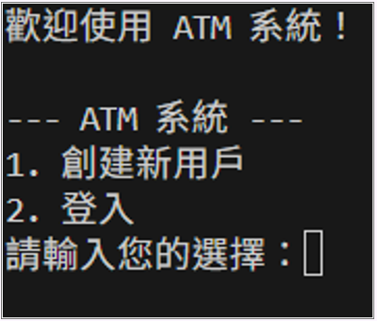
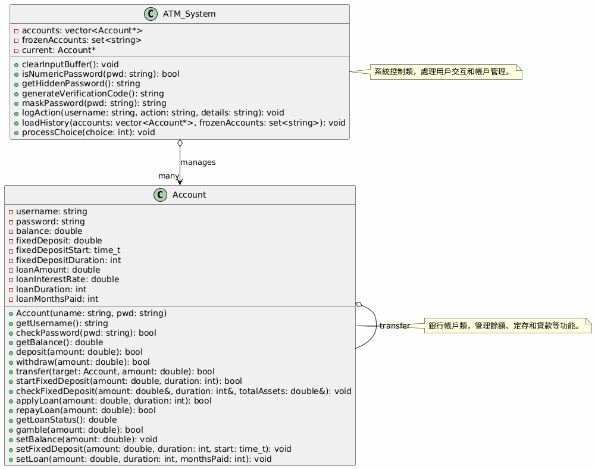
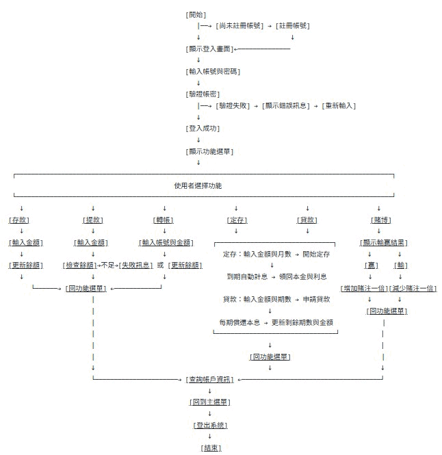
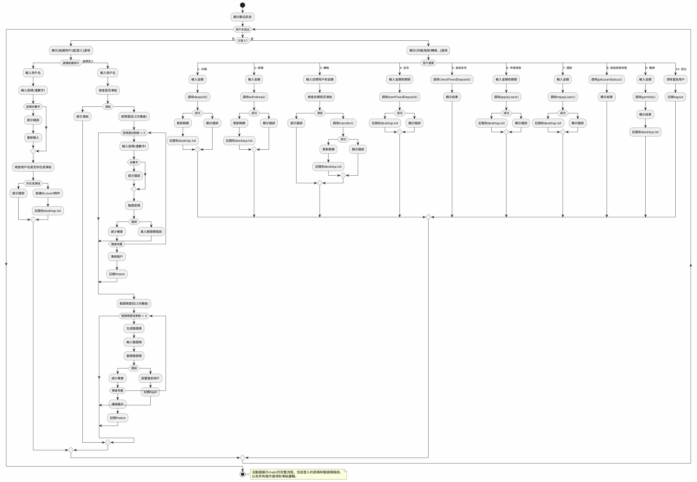

組別號碼:13

系及班級:資工１A

成員資訊:廖廷安、李浩廷、胡閔傑

小專題題目:簡易ATM系統

🏧 ATM 系統專題 (C++) 

這是一個使用 C++ 撰寫的模擬 ATM 系統，包含帳戶管理、存提款、轉帳、定期存款、貸款功能，以及帳戶資訊的封裝與操作。系統採用類別封裝帳戶資訊，並提供簡單的互動式選單供使用者操作。 

 

📁 專案檔案說明 
Account.h：定義 Account 類別的屬性與功能。 

Account.cpp：實作 Account 類別的成員函式。 

main.cpp：主程式，提供使用者互動介面，包含帳戶操作與功能選單。 

 

🔐 帳戶功能 (Account 類別) 

成員資料:

    ·使用者名稱
    ·密碼帳戶餘額
    ·定存金額與時間
    ·定存開始時間
    ·貸款金額與期數
    ·已繳期數

🧪 執行流程 

使用者可以透過主程式選單進行以下操作： 
    
    1.創建帳號:創建自己的帳號
    2.登入系統(填寫密碼和驗證碼):確保是帳戶本人
    3.存錢:存入金額
    4.取錢:取出金額
    5.轉帳:轉入給其他帳號的人(需確保有這個帳號名稱)
    6.定存:將為單利狀態
    7.查詢定存:查詢目前的定存狀況
    8.貸款:將為複利狀態
    9.還款:繳交貸款的金額
    10.查詢貸款狀況:可以即時查閱自己的貸款狀況
    11.賭博:跟銀行賭注金額，勝率為50%
    12.登出:結束並登出

系統功能說明:

未登入時功能：
創建新用戶帳戶
用戶登入

📖 UML 設計

🎫 流程圖

                    

    

📠分工資訊:

廖廷安 : 製作報告、撰寫程式、修改程式、debug、提供草稿和想法、製作README

李浩廷 : 製作報告、修改程式、提供想法、製作README

胡閔傑 : 報告

